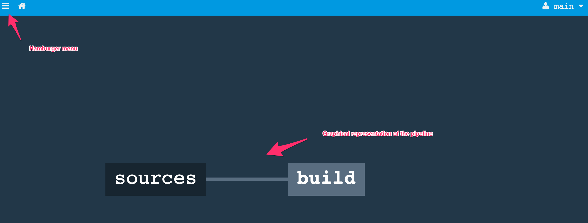
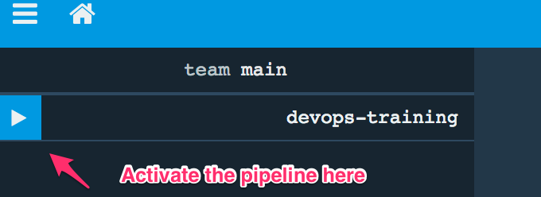
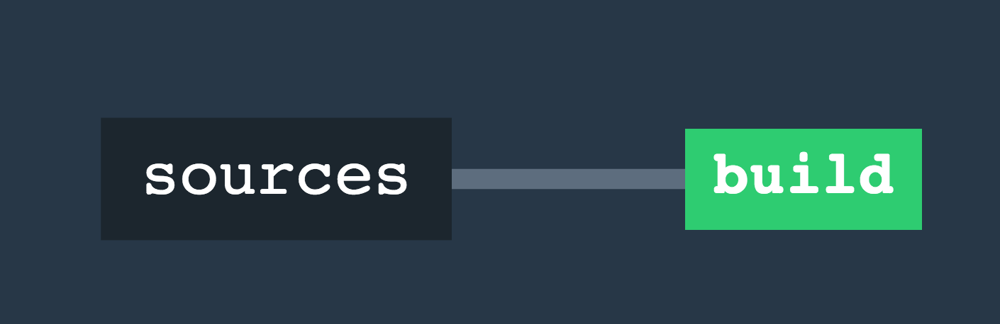
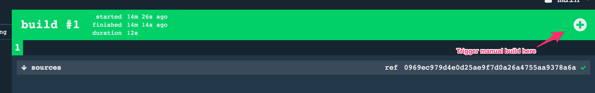

# Exercise 002 - Create a pipeline and the first build job

With this first build a gradle build is called within an concourse context.

## Create a new pipeline in concourse.

For the initial creation of the pipeline the fly command is used. This also used when the 'seed' job is updated.

Apply the following steps to create the seed pipeline configuration:

- Step into the **DevOpsTraining** directory.
- Create a **pipeline.yml** file
- Add the following content to the **pipeline.yml** file, and replace the private key with private key that matches 
public key that was supplied in exercise-001. [Concourse GIT resource](https://github.com/concourse/git-resource)
```yaml
# Resource section
resources:
- name: sources # Name of the resource
  type: git # Resource type
  source:
    uri: git@github.com:Hylke1982/DevOpsTraining.git
    private_key: ((private-repo-key))

# Jobs section
jobs:
- name: build # Name of the job
  plan: # Steps in the job
  - get: sources
    trigger: true
```
- After saving the new pipeline can be created with **fly set-pipeline**
```bash
$ fly -t lite set-pipeline -p devops-training -c pipeline.yml
```
- After applying the pipeline configuration you will get a message like this.

- Now the pipeline is visible in the [concourse web interface](http://localhost:23234/teams/main/pipelines/devops-training)
accessing the web interface can be done with username **concourse** and password **changeme**.

- The pipeline can now be activated by clicking on the 'play' button in the 'hamburger menu'

- After activating the pipeline will execute and will show green


## Add additional steps to build job plan

The previous step will checkout code but does no actual build of an application. Now it is time to do a *gradle build*.

- Extend the **build** job with additional step that does the gradle build
```yaml
jobs:
- name: build
  plan:
  - get: sources
    trigger: true
  - task: build software
    config:
      platform: linux
      image_resource:
        type: docker-image
        source: {repository: openjdk, tag: 8-alpine} # Docker container to build in
      inputs:
        - name: sources # Use the source resource
      run:
        path: ./gradlew # Command to execute
        args: ["build"]
        dir: sources/application # Location to execute, note the 'sources' as directory prefix
```
- Update the pipeline by execute the following command. ```$ fly -t lite set-pipeline -p devops-training -c pipeline.yml```
- Now trigger a manual build (no code changes committed to trigger the build)


Now it is time to make the build plan part of the source control, making the pipeline.yml the seed job.

**Note: Because the training runs on docker-compose caching the result of a build is not stored. This means everytime a full 
build is done.**