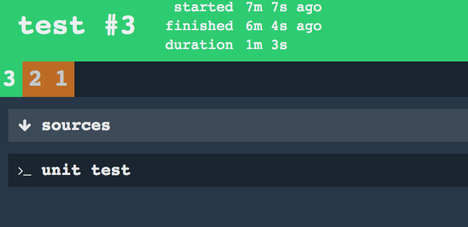

# Exercise 004 - Create a test job

Testing is important part of the DevOps lifecycle, every test step added adds a level of trust to the application.

## Create a test job

The job for testing is a composition of tasks that validate the quality of the application.

- In the **pipeline.yml** add a new job with name **test**
```yaml
- name: test # Name of the job
  plan:
  - get: sources # Download the sources
    trigger: true
    passed: [build] # Trigger after job build has passed
  - task: unit test
    file: sources/CI/task-unit-test.yml
```
- Create a new task definition in the **CI** directory with the name **task-unit-test.yml**. The task should have the 
following content.
```yaml
platform: linux

image_resource:
  type: docker-image
  source: {repository: openjdk, tag: 8-alpine}
inputs:
  - name: sources

run:
  path: ./gradlew
  args: ["test"]
  dir: sources/application
```
- Commit the changes and push them
- After a few moments a new build is triggered
- Update the pipeline with ```$ fly -t lite set-pipeline -p devops-training -c pipeline.yml --load-vars-from secrets.yml```
- After the pipeline update the pipeline should look like this.



Continue building the pipeline with a [deployment](exercise-005.md).


