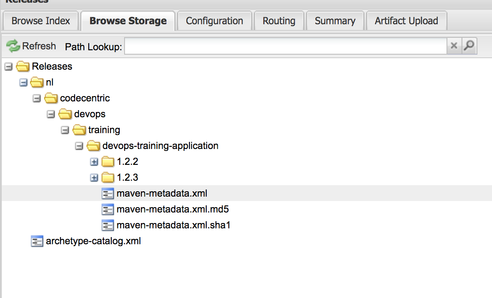
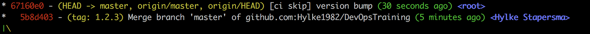

# Exercise 005 - Deploy to Nexus, and bump the version

After build and test are successful it is time to create a deployment to a artefactory. In the training Nexus is used. 
Storing it in a artifactory helps to distribute and share share software with others.

## Create the deployment job.

The goal here is to place a artifact in Nexus and also make a tag in the source control system to make visible what the 
version contains. To achieve this, take these steps:

- Extend the **pipeline.yml** file with a new job called **deploy**. This job consists of 3 tasks, getting the sources, 
tag, version bump and deploy to nexus step and pushing the changes to git.
```yaml
- name: deploy # Name of the job
  plan:
  - get: sources # Download the sources
    trigger: true
    passed: [test] # Trigger after job test has passed
  - task: tag, publish and publish new version
    file: sources/CI/task-deploy.yml
  - put: sources
    params: {repository: sources-output} # Push latest version after tagging en version bump
```
- Create a new task definition for tag, version bump and deploy in the **CI** directory, with the file name 
**task-deploy.yml**. The contents of this file should be:
```yaml
platform: linux

image_resource:
  type: docker-image
  source: {repository: openjdk, tag: 8}

inputs:
- name: sources

outputs:
- name: sources-output # Output to special name space

caches:
  - path: ["sources/application/build","sources/application/.gradle"]

run: # Gradle release + version bumping
  path: sh
  args:
  - -exc
  - |
    git config --global user.email "concourse@build.com"
    git clone sources sources-output
    cd sources-output/application
    ./gradlew printVersion
    ./gradlew tag -Prelease build uploadArchives
    ./gradlew printVersion
    git commit --allow-empty -a -m "[ci skip] version bump"
    ./gradlew -PbumpComponent=patch
    ./gradlew printVersion
    git status
```
- A script is executed within in the run section of the tasks, which basically creates a for the version, uploads the 
artifact to artifactory and bumps the version. A **output** is used to store the changes and these changes are then 
pushed to the git repository
- Open [nexus](http://localhost:23235/nexus/#view-repositories;releases~browsestorage) to view the published artifact.

- Also view the git log for the tags


Now it is time to run the software in the [next exercise](exercise-006.md).

